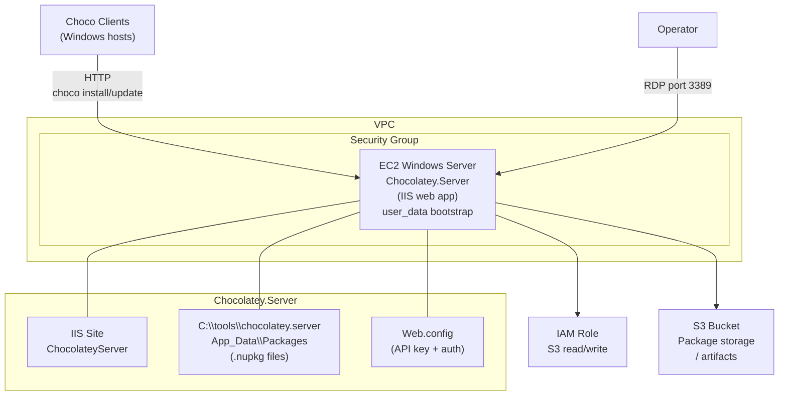

# Windows Package Repository Lab (Chocolatey)

Terraform lab for deploying a self-hosted Chocolatey NuGet package repository on AWS. Provisions a Windows EC2 instance running IIS with the Chocolatey.Server web application, backed by an IAM role for S3 access.

## Architecture



## Repository Structure

```
├── chocolatey-repository/
│   ├── main.tf               # EC2 + security group + IAM role + S3
│   ├── user_data.tpl         # Bootstrap: installs IIS + Chocolatey.Server
│   ├── variables.tf          # Input variables
│   ├── outputs.tf            # Output values
│   ├── assume_role_policy.json  # EC2 trust policy
│   └── policy_s3_bucket.json    # S3 access policy
└── modules/
    ├── ec2_instance/         # EC2 module
    ├── ec2_role/             # IAM role module
    └── sg_security_group/    # Security group module
```

## Prerequisites

- [Terraform](https://learn.hashicorp.com/tutorials/terraform/install-cli) installed
- [AWS CLI](https://docs.aws.amazon.com/cli/latest/userguide/getting-started-install.html) configured
- Existing VPC with at least one subnet
- IAM user with admin permissions

## Variables to Update

| Variable | Description |
|----------|-------------|
| `vpc_id` | Target VPC ID |
| `subnet_id` | Subnet ID for EC2 placement |
| `image_id` | Windows Server AMI ID |
| `region` | AWS region |
| `cidr_blocks` | VPC CIDR for internal access |

## Usage

```shell
aws configure

terraform init
terraform plan
terraform apply --auto-approve
```

## Post-Deployment

The `user_data` bootstrap creates an IIS site called **ChocolateyServer** at `C:\tools\chocolatey.server`. A default `Web.config` is generated — change the default API key and credentials before exposing to production networks.

**Push a package to the repository:**
```powershell
choco push MyPackage.1.0.0.nupkg --source="http://<EC2_IP>/chocolatey" --api-key="<your-api-key>"
```

**Register the repository on choco clients:**
```powershell
choco source add -n=MyRepo -s="http://<EC2_IP>/chocolatey"
choco install <package-name>
```
